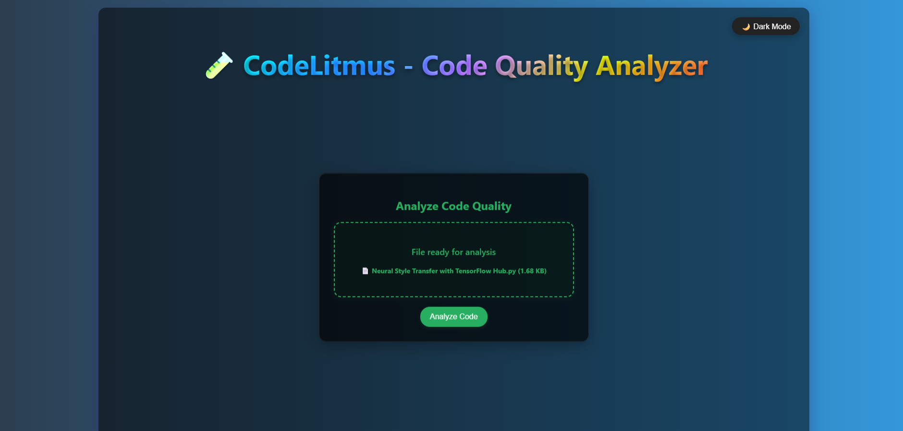

# 🧪 CodeLitmus - Advanced Code Quality Analyzer

<div align="center">


[](https://python.org)
[](https://fastapi.tiangolo.com/)
[](LICENSE)
[](CONTRIBUTING.md)

**A modern, interactive web application that performs comprehensive code quality analysis with beautiful visualizations and detailed metrics.**

[🚀 Live Demo](#demo) • [📖 Documentation](#documentation) • [🛠️ Installation](#installation) • [🤝 Contributing](#contributing)

</div>

---

## ✨ Features

### 🎯 **Core Functionality**
- **🔍 Multi-Language Support**: Analyze Python, JavaScript, TypeScript, Java, C++, C, and C# files
- **📊 Comprehensive Metrics**: Cyclomatic complexity, maintainability index, and comment coverage
- **🏆 Smart Verdict System**: Get clear ratings (Basic/Neutral/Acidic) with detailed explanations
- **📈 Visual Progress Indicators**: Beautiful progress bars and animated feedback

### 🎨 **Modern UI/UX**
- **🌈 Gradient Animations**: Eye-catching rainbow gradient title with pulse effects
- **🌙 Dark/Light Mode**: Seamless theme switching for comfortable viewing
- **📱 Responsive Design**: Perfect experience on desktop, tablet, and mobile
- **🎭 Interactive Animations**: Hover effects, smooth transitions, and engaging feedback

### 🚀 **Advanced Features**
- **📄 PDF Report Generation**: Download comprehensive analysis reports
- **📂 Drag & Drop Upload**: Intuitive file upload with progress tracking
- **⚡ Real-time Analysis**: Instant feedback with loading animations
- **🔄 Progressive Layout**: Dynamic interface that adapts during analysis

---

## 🖼️ Screenshots

<div align="center">

### 🏠 Main Interface
*Modern CodeLitmus interface with rainbow gradient title and glassmorphism effects*


### 📂 File Upload
*Drag & drop file upload with animated progress indicators*


### 📊 Analysis Results
*Comprehensive code analysis with detailed metrics and visual feedback*


*Detailed metrics breakdown with color-coded feedback*


*Advanced metrics analysis with professional insights*


### 🌙 Dark Mode
*Beautiful dark theme for comfortable coding sessions*


### 📱 Mobile Responsive
*Perfect mobile experience with touch-friendly interface*


### 📄 PDF Reports
*Professional PDF report generation with detailed insights*


</div>

### 📱 Mobile Responsive


</div>

---

## 🛠️ Installation

### Prerequisites
- **Python 3.8+** 
- **pip** (Python package installer)
- **Git** (for cloning the repository)

### Quick Start

```bash
# 1️⃣ Clone the repository
git clone https://github.com/prathamesh9930/CodeLitmus.git
cd CodeLitmus

# 2️⃣ Navigate to backend directory
cd backend

# 3️⃣ Install dependencies
pip install -r requirements.txt

# 4️⃣ Run the application
python app.py
# OR using uvicorn directly
uvicorn app:app --reload --host 0.0.0.0 --port 8000

# 5️⃣ Open your browser
# Visit: http://localhost:8000
```

### 🐳 Docker Setup (Optional)

```bash
# Build and run with Docker
docker build -t codelitmus .
docker run -p 8000:8000 codelitmus
```

---

## 🎮 Usage Guide

### � **Uploading Files**
1. **Drag & Drop**: Simply drag your code file onto the upload area
2. **Browse**: Click to open file browser and select your file
3. **Support**: `.py`, `.js`, `.ts`, `.java`, `.cpp`, `.c`, `.cs` files supported
4. **Progress**: Watch the upload progress with animated indicators

### 🔬 **Code Analysis**
1. **Automatic Processing**: Files are analyzed immediately after upload
2. **Comprehensive Results**: Get detailed breakdown of:
   - **🔄 Complexity Analysis**: Function-level complexity metrics
   - **🔧 Maintainability Score**: Overall code maintainability (0-100)
   - **💬 Comment Coverage**: Documentation quality assessment
   - **✅ Strengths**: What your code does well
   - **🔧 Improvements**: Specific areas for enhancement

### 📄 **PDF Reports**
1. **One-Click Download**: Generate professional PDF reports
2. **Clean Formatting**: Optimized layout with proper spacing
3. **Comprehensive Data**: All metrics and recommendations included

---

## 🏗️ Project Architecture

```
CodeLitmus/
├── 🔧 backend/
│   ├── 📱 app.py                 # FastAPI main application
│   ├── 🧠 analyzer.py            # Core analysis engine
│   ├── 📋 requirements.txt       # Python dependencies
│   ├── 🎨 static/
│   │   └── style.css            # Enhanced styling & animations
│   ├── 🖼️ templates/
│   │   └── index.html           # Modern responsive interface
│   └── 📁 uploads/              # File storage directory
├── 🌐 frontend/                  # Legacy frontend (reference)
├── 📖 README.md                  # This file
└── 📜 requirements.txt           # Root dependencies
```

---

## 🔧 API Reference

### Core Endpoints

| Method | Endpoint | Description | Response |
|--------|----------|-------------|----------|
| `GET` | `/` | Main application interface | HTML page |
| `POST` | `/analyze/` | Analyze uploaded code file | JSON analysis results |

### Analysis Response Format

```json
{
  "verdict": "Basic|Neutral|Acidic",
  "verdict_explanation": "Detailed explanation",
  "score": "1-3 scale rating",
  "feedback": ["Quick summary points"],
  "detailed_feedback": {
    "good_points": ["Strengths identified"],
    "areas_for_improvement": ["Specific improvements"],
    "metrics_explanation": {
      "complexity": "Detailed complexity analysis",
      "maintainability": "Maintainability insights", 
      "comments": "Documentation assessment"
    }
  }
}
```

---

## 📊 Quality Metrics Explained

### 🔄 **Cyclomatic Complexity**
- **Scale**: 1-5 (Simple) | 6-10 (Moderate) | 11+ (Complex)
- **Target**: < 5 for optimal maintainability
- **Measures**: Decision points and code paths

### 🔧 **Maintainability Index**
- **Scale**: 0-49 (Poor) | 50-69 (Average) | 70-100 (Excellent)
- **Target**: > 70 for good maintainability
- **Factors**: Complexity, volume, and documentation

### 💬 **Comment Coverage**
- **Scale**: <10% (Poor) | 10-20% (Good) | >20% (Excellent)
- **Target**: > 10% for adequate documentation
- **Calculation**: Comments / Total lines of code

---

## 🛠️ Development

### Running in Development Mode

```bash
# Enable auto-reload for development
uvicorn app:app --reload --port 8000

# With debugging
uvicorn app:app --reload --log-level debug
```

### 🧪 Testing

```bash
# Run tests (when implemented)
pytest tests/

# Code quality check
flake8 backend/
black backend/
```

---

## 🤝 Contributing

We welcome contributions! Please see our [Contributing Guidelines](CONTRIBUTING.md) for details.

### 🚀 **Quick Contribution Steps**
1. **Fork** the repository
2. **Create** a feature branch (`git checkout -b feature/AmazingFeature`)
3. **Commit** your changes (`git commit -m 'Add some AmazingFeature'`)
4. **Push** to the branch (`git push origin feature/AmazingFeature`)
5. **Open** a Pull Request

---

## 📋 Dependencies

### Core Technologies
- **[FastAPI](https://fastapi.tiangolo.com/)** - Modern, fast web framework
- **[Uvicorn](https://www.uvicorn.org/)** - Lightning-fast ASGI server
- **[Radon](https://radon.readthedocs.io/)** - Code metrics analysis engine
- **[Jinja2](https://jinja.palletsprojects.com/)** - Powerful template engine

### Frontend Libraries
- **[jsPDF](https://github.com/parallax/jsPDF)** - PDF generation
- **Vanilla JavaScript** - No framework dependencies
- **CSS3** - Modern styling with animations

---

## 🐛 Troubleshooting

### Common Issues

| Issue | Solution |
|-------|----------|
| **Port already in use** | Change port: `uvicorn app:app --port 8001` |
| **Module not found** | Install dependencies: `pip install -r requirements.txt` |
| **File upload fails** | Check file size (<5MB) and format |
| **Analysis stuck** | Refresh page and try smaller file |

---

## 📜 License

This project is licensed under the **MIT License** - see the [LICENSE](LICENSE) file for details.

---

## 🙏 Acknowledgments

- **Radon** team for excellent code metrics library
- **FastAPI** community for the amazing framework
- **Contributors** who helped improve this project

---

<div align="center">

### 🌟 **Star this repository if you found it helpful!**

**Made with ❤️ by [Prathamesh](https://github.com/prathamesh9930)**

[⬆ Back to top](#-codelitmus---advanced-code-quality-analyzer)

</div>
